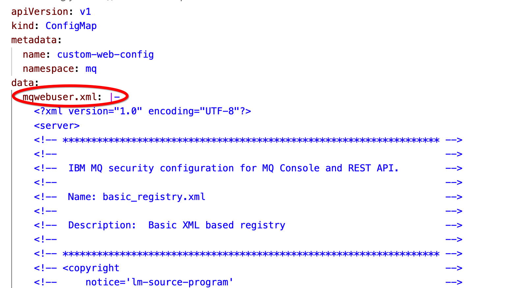

# Customized web user interface configuration


The configuration of the MQ web user interface in non-containerized environments is defined in the following locations:
- Unix/Linux: `var/mqm/web/installations/<installationName>/servers/mqweb`
- Windows: `C:\ProgramData\IBM\MQ\web\installations\<installationName>\servers\mqweb`

The details can be found in the MQ documentation in the chapter [Basic configuration for the mqweb server](https://www.ibm.com/docs/en/ibm-mq/9.3?topic=api-basic-configuration-mqweb-server)

In the case of running MQ in a container (as part of CP4I on OpenShift) the web configuration is by default located in the directory:
```
/etc/mqm/web/installations/Installation1/servers/mqweb
```
When the instance of MQ is created in OpenShift, the service that points to the web interface and the route that exposes the service are automatically defined.

It is possible to customize the configuration. The example [basic_registry.xml](example/basic_registry.xml) shows the configuration of xml registry with two users (*mqadmin* and *mqreader*) created each in a specific security role.

The following file with a similar role is by default created in the container:
```
/etc/mqm/web/installations/Installation1/servers/mqweb/mqwebuser.xml
```

For an illustration, we will try to replace its content with the content from the [basic_registry.xml](example/basic_registry.xml) example and expose the new web interface to external users.

Those are the high-level steps:
- Create a ConfigMap with the new content of *mqwebuser.xml*
- Map the file inside the container to the ConfigMap entry
- Create a service that points to the new web interface definition
- Create a route that exposes this service

## ConfigMap content

Since the original configuration file is called *mqwebuser.xml*, we will create an entry in the ConfigMap with the same name and put everything from the [basic_registry.xml](example/basic_registry.xml) in it:



The full ConfigMap example is available here: [custom-web-config.yaml](example/custom-web-config.yaml)


