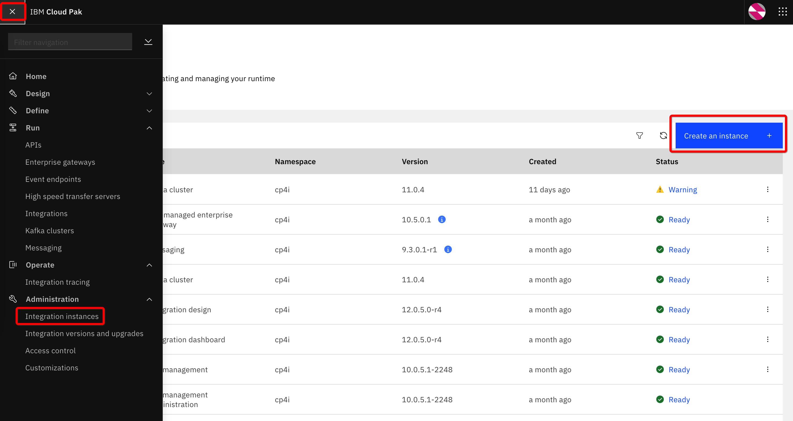
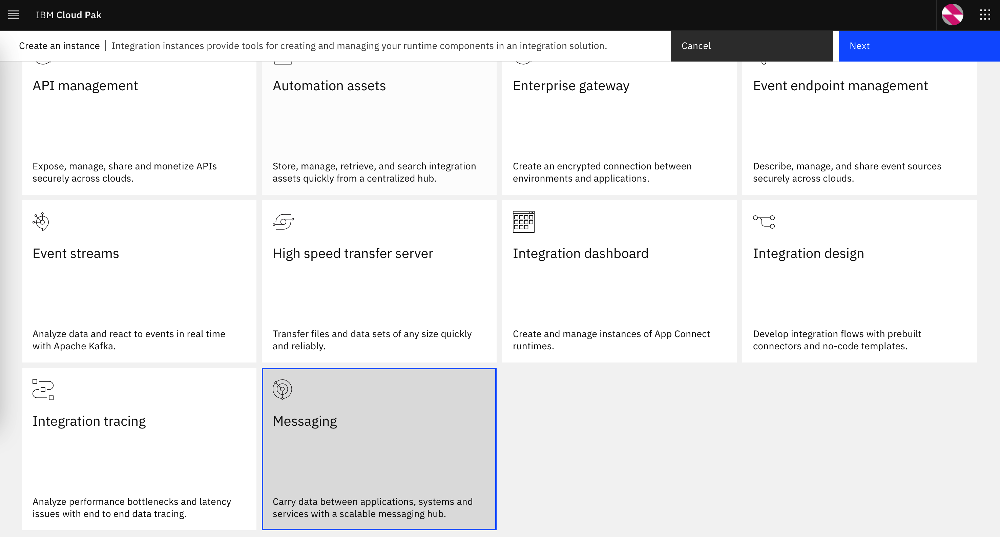
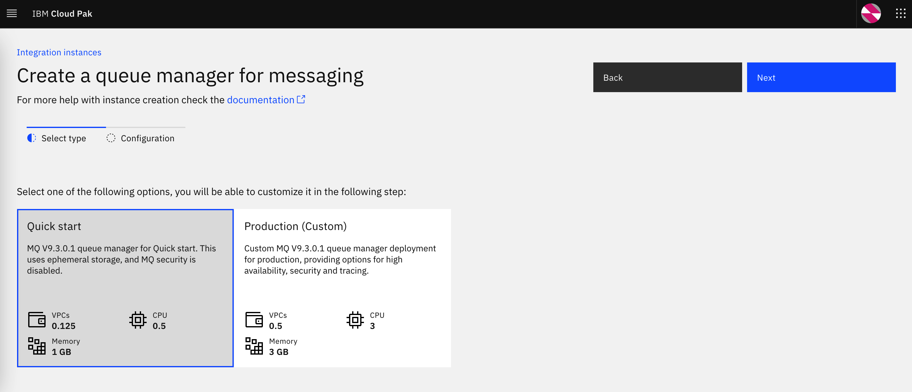
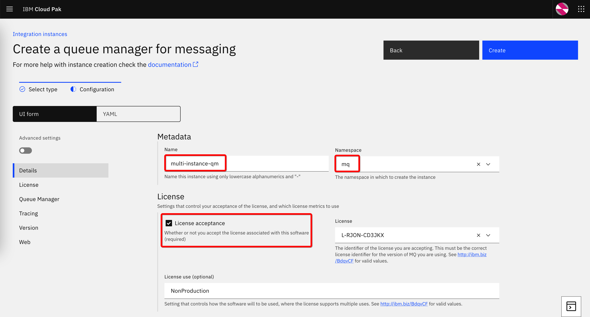
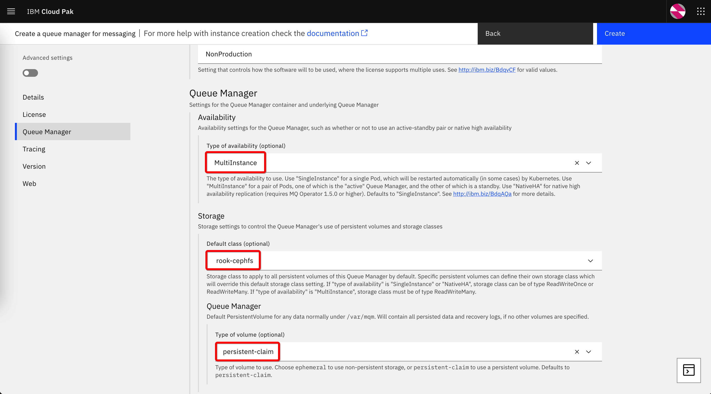
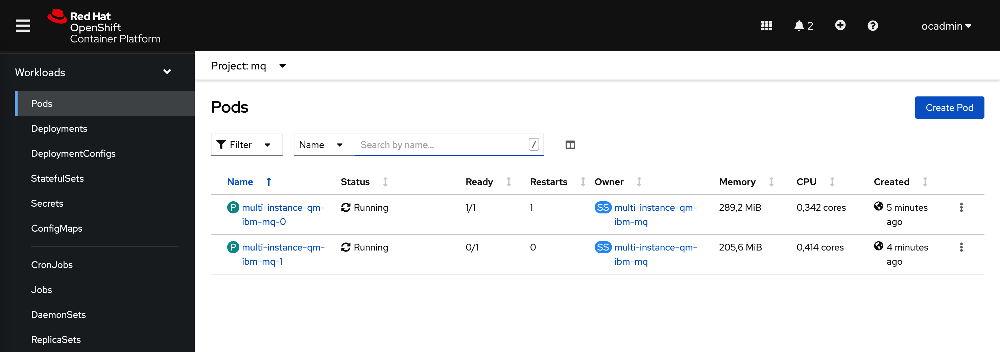
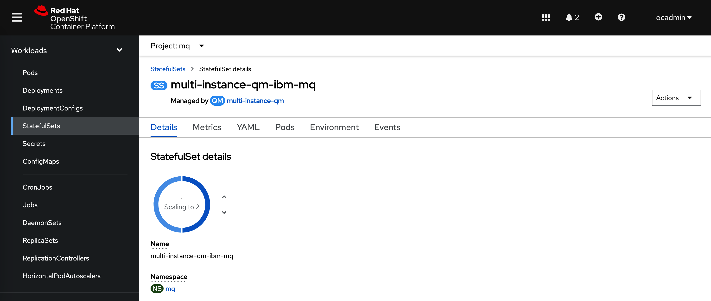
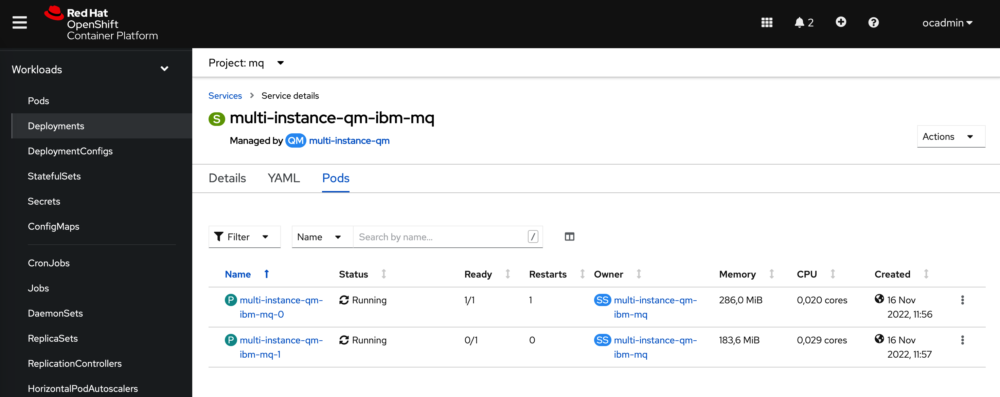
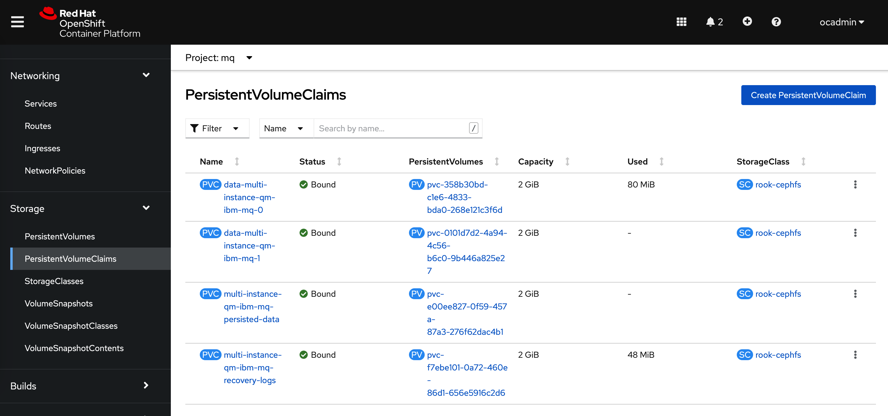

# IBM MQ - Multi-instance


## Create a multi-instance queue manager using the Platform Navigator

Navigate to Integration instances and click on Create an instance



Select **Messaging**, click Next



and then select one of the provided options, for example, *Quick start*:



Enter the name, select the namespace and accept the license:



Scroll down. Select **MultiInstance** for the type of availability, the storage class of the **RWX** type (in our example it is *rook-cephfs*), and select **persistent-claim** for the type of volume. Leave default values for other properties and click on **Create**:



As a result, two pods are created. One is active and the other in standby:



There is one stateful set that controls both pods:



There is also one service that routes the traffic to the active pod:



Several persistent volume claims that provide storage for the queue managers are also created:



This is the YAML representation of the Queue Manager generated by the Platform Navigator :

```yaml
apiVersion: mq.ibm.com/v1beta1
kind: QueueManager
metadata:
  name: multi-instance-qm
  namespace: mq
spec:
  license:
    accept: false
    license: L-RJON-CD3JKX
    metric: VirtualProcessorCore
    use: NonProduction
  queueManager:
    availability:
      type: MultiInstance
      updateStrategy: RollingUpdate
    debug: false
    imagePullPolicy: IfNotPresent
    livenessProbe:
      failureThreshold: 1
      initialDelaySeconds: 0
      periodSeconds: 10
      successThreshold: 1
      timeoutSeconds: 5
    logFormat: Basic
    metrics:
      enabled: true
    name: QUICKSTART
    readinessProbe:
      failureThreshold: 1
      initialDelaySeconds: 0
      periodSeconds: 5
      successThreshold: 1
      timeoutSeconds: 3
    resources:
      limits:
        cpu: 500m
        memory: 1Gi
      requests:
        cpu: 500m
        memory: 1Gi
    route:
      enabled: true
    startupProbe:
      failureThreshold: 24
      initialDelaySeconds: 0
      periodSeconds: 5
      successThreshold: 1
      timeoutSeconds: 5
    storage:
      defaultClass: rook-cephfs
      persistedData:
        enabled: true
        size: 2Gi
        type: persistent-claim
      queueManager:
        size: 2Gi
        type: persistent-claim
      recoveryLogs:
        enabled: true
        size: 2Gi
        type: persistent-claim
  securityContext:
    initVolumeAsRoot: false
  template:
    pod:
      containers:
        - env:
            - name: MQSNOAUT
              value: 'yes'
          name: qmgr
          resources: {}
  terminationGracePeriodSeconds: 30
  tracing:
    agent: {}
    collector: {}
    enabled: false
    namespace: ''
  version: 9.3.0.1-r2
  web:
    enabled: true
```

## Create a multi-instance queue manager manually by applying the YAML definition

The following example shows an "all-in-one" YAML that describes a bit more complex configuration. It includes:
- a set of MQSC commands that are executed when the pod is created
- TLS configuration (for the instructions on how to create the self-signed certificates, please see [Working with the self-signed certificates](../../topics/miscellaneous/self-signed-certs.md))
- an additional route that points to the channel and is used for external access (please see [Accessing from the external client](../interconnection/external-client.md))

>**Note:** We assume that the instance is created in the namespace called *mq*. Please change it if you are applying this in another namespace.

>**Note:** The storage class defined in the queue manager YAML is *rook-cephfs* Please change it to the RWX class available in your environment. 

>**Note:** For legal reasons the value of queue manager's *spec.license.accept* is set to *false*. Please change it to *true* if you are copying/pasting the example.

You can apply the YAML using the command line: `oc apply -f <file-with-the-yaml-content>` <br>
or using the OpenShift web console: 


```yaml
kind: ConfigMap
apiVersion: v1
metadata:
  name: mqmultiinstancemqsc
  namespace: mq
data:
  disablesecurity.mqsc: |-
    define ql(APPQ)
    DEFINE CHANNEL(MIQMGRCHL) CHLTYPE(SVRCONN) TRPTYPE(TCP) SSLCAUTH(OPTIONAL) SSLCIPH('ANY_TLS12_OR_HIGHER')
    set chlauth(MIQMGRCHL) TYPE(BLOCKUSER) USERLIST(NOBODY)
    REFRESH SECURITY TYPE(CONNAUTH)
---
kind: Secret
apiVersion: v1
metadata:
  name: mqmultiinstancecert
  namespace: mq
data:
  tls.crt: LS0tLS1CRUdJTiBDRVJUSUZJQ0FURS0tLS0tCk1JSURDVENDQWZHZ0F3SUJBZ0lVR0tiaE5ZWXJMZVdqUFBVTlp5RldJTjJQWExRd0RRWUpLb1pJaHZjTkFRRUwKQlFBd0ZERVNNQkFHQTFVRUF3d0piRzlqWVd4b2IzTjBNQjRYRFRJd01ERXdOakV3TURjeU4xb1hEVE13TURFdwpNekV3TURjeU4xb3dGREVTTUJBR0ExVUVBd3dKYkc5allXeG9iM04wTUlJQklqQU5CZ2txaGtpRzl3MEJBUUVGCkFBT0NBUThBTUlJQkNnS0NBUUVBem5EbkpGaHhFMGRMTFdhOUZZQlBvakZNdWVSL1pESXJZTEE0OGFWYVNNYU8KRjhNT0o0RGpHQWJ1L0UwbjlIR3JxSXI5bnRSc29SZkhjMFdhcExDcFdwdXdnWlBFSXVXR25MS2xjdVJtYnRVVApUUlkvQkhITEtrVUFncnlCUXVqZFh2RFRobnltYXZCUGpLM1QxZlZFMGNFT1lHQTlHanJYU0IzT2hQR1pHQmxOCmM5NXppZEZSOVZyWHQwRFJDVkFrNjRmYlRoa3V2SDh1TkV1VGFodlVFOVJIZmRzajJzZU81S0k3bmdYMG1IUUIKcUlMdVAzcGEreU1WNUc4TlBaalN4U0IwQjNlS3YraUNjV2hSdTZSRmIyZmNmZXpnbm1TcFJYVTUwS1lxV1piZApvc0czaFFxU1JRUTJZUmR5NzZaMGJKb3FGM3N0aGJJaTZ5TmYvTVQ5ZndJREFRQUJvMU13VVRBZEJnTlZIUTRFCkZnUVVIQlBGY0FyTy9ZUmxiZ0tobmkxSVdnS0Z5VEF3SHdZRFZSMGpCQmd3Rm9BVUhCUEZjQXJPL1lSbGJnS2gKbmkxSVdnS0Z5VEF3RHdZRFZSMFRBUUgvQkFVd0F3RUIvekFOQmdrcWhraUc5dzBCQVFzRkFBT0NBUUVBWkZ6SQpaLzZOay9TQmY0WXJHdVdNSzVjTTRLdldjWUdXQWlndTZ1TzZvV2VUVmdYamtGbE9GZ2RHRVhpSjFZNi9mRFBCCitaMVE0SERMYm1hbGE1aXRqeVhXbWFsRTFFOHR2bThGMDA5ZEFPL0oxUmNyS1VZcUFKbGJQNTZtbmt1QmtqZE0KYzAyMkhXOTd0RUpkYXViTlF2ZWJraDhZK1loUGVkV242ZmFtMVM1S2cwYUlVUWRKd0FuZDlCb2hLVkk3SHFFZgpoUktDYmJFZzNySXlSS0FLdk5DRXlvMjY4b3VIcll3Mi9WMEhMU0VnWEU3UTFxWTVKaXF6Y3Iyb0EvU2xZdGZwCnZYZFhKajA3OGJ1N3hrS2FxZkxpN3FTSzdjSVRjWjNWcldGOWZCbEh5MVV1K2V1NVNhN29udFR2MktON2Joc1QKNGczVTlMdWR2L01xTE5EWDVnPT0KLS0tLS1FTkQgQ0VSVElGSUNBVEUtLS0tLQo=
  tls.key: LS0tLS1CRUdJTiBQUklWQVRFIEtFWS0tLS0tCk1JSUV2UUlCQURBTkJna3Foa2lHOXcwQkFRRUZBQVNDQktjd2dnU2pBZ0VBQW9JQkFRRE9jT2NrV0hFVFIwc3QKWnIwVmdFK2lNVXk1NUg5a01pdGdzRGp4cFZwSXhvNFh3dzRuZ09NWUJ1NzhUU2YwY2F1b2l2MmUxR3loRjhkegpSWnFrc0tsYW03Q0JrOFFpNVlhY3NxVnk1R1p1MVJOTkZqOEVjY3NxUlFDQ3ZJRkM2TjFlOE5PR2ZLWnE4RStNCnJkUFY5VVRSd1E1Z1lEMGFPdGRJSGM2RThaa1lHVTF6M25PSjBWSDFXdGUzUU5FSlVDVHJoOXRPR1M2OGZ5NDAKUzVOcUc5UVQxRWQ5MnlQYXg0N2tvanVlQmZTWWRBR29ndTQvZWxyN0l4WGtidzA5bU5MRklIUUhkNHEvNklKeAphRkc3cEVWdlo5eDk3T0NlWktsRmRUblFwaXBabHQyaXdiZUZDcEpGQkRaaEYzTHZwblJzbWlvWGV5MkZzaUxyCkkxLzh4UDEvQWdNQkFBRUNnZ0VBQ0czcndqd3FRZE5EYXBNclhWbGo1d2VFVG9MYUFNbGJwQk1PQUMvMFE4eDMKdU5pcUYwclgrdjh0ZXZmYmpjdW1hcmRpSzc0WXdXc3JKYlhOM3JPbjlwOHMwZDJxd0pJR3NSZEtVaXFwVkJVMwpPSXFVQUNaMVdVQ0FDTmFSb0ozSmpEcmhLRGltd3U4VkVIVjRsTi95ODIyaW5LVFJXZVRWTFlpcUNodWpXS3g5CkNvUU9qeFpkZFFxV0xNbEtndFRQOGUxSTI2MmNUbVhzVzhhSWQ4dDVpWUZmcFc2OHpLTzZqSmRVWktpdnE2MkcKc3hqYnF5Kzk1SitqbzBLeWUybzN0M2NFempJUEk4L1hhRmllTlFFTUZtRWVlVzVSNE1iZ3VNblpocTBVV1BzSwpWdHE0Ukp2OW02aC9RWGlqMGVCY281Rnp2MFB5RHZtUFkrZWUwT1plQVFLQmdRRHBQUm9wanpMYjhFRnUzcnU2Cktyc1BNYzUvbUc4S1pmY0NGejdjSHRQdTJEQzZxTytpRXhkVk5xZ2h6ZGtLK05kalFGUGNmdlRQZXhCOWhsWUEKN0NtOE1QRkxSNUhNditFL3BSQm5UNzVLZHdhT2NjT21ibFNGSE1LSjhJVXZld3daaERhQWFFWlNmQld0TU9GdwpKa0FrTDdMTWxkL0Ixbk9LaDM5YmR1ZEpRUUtCZ1FEaWxsT3ZGVkVjaUxyM28yR1JzUnhIK1lMQkJjbUZpSEo2CngzQ1JNQjRPMldZMjJPYXpsZVJZUXdqdU1PS2xGNmNiR0VBR1JKaVRIbGo2MFE0cXVwbERrbVJTdWVJcnBRMTEKU3A1MnMranY3WXpZdFpxUG00UzFtaG9xcU1iRDg2V2VEZnp6RUIweWJPUk8xZW04NXRqZStoN3FvN0Y5QWUrSwplU29TUDduV3Z3S0JnQUpTQlV5Y2pCajhEdXFYZEs2cGRpcjBoK1ZsRXRXN3BmVnpYY0M2M2NqbWhiV1ZzS3lnCkcvOVJCK011TlJhUzJ6RzFsaC8vYzFnTkZXRHFVVGk1SU1FcWkzd0FQa2NYTVpwOGZlbEpOYzl2MTdUYkZPTTIKL2NoRlBQbzZWbGplbElROGVINVdpenlPMTNoZG9DQ0pnT0hiUjZBWmJaeDBFYm96RnVWR0RZOEJBb0dBUCs1QQpRRWNZY3ArVmVTZU04T2x5M0UvbTk0VWxmZHFveWtHWlhpMmdYWG96WDhoRkYyaDBXLzdWOXphdHkvem5kanFhClhlcGV6aXVpMlduQXdJZVRsTUFxTkRra09rSkFrTlp6N1hRSGhpS1ZPZFBMZnpkVzgxSStqY2kvQkN5cmp2UE4KYWRzakVjWXRpSnpNYlRNSS82aThybUZ2UTZFWE1BL05zZ1p1N2NzQ2dZRUFpN2RWYzhkNmNUUVFKR05HL0l4Vwo2d1dJN1U3V094OTNVTlFEZGVyQUhNeFRBMXRKbHdTRmtNUzYrWXAvZzU0K0tTQWZLTWw4eDVUTnRxM1lpUEdiCkozOGtVU2lxV2VudFYzeExMVmJMRTRUYXgxbkptK0ZFNDV4VWxwYjJyTU5kYjFuOFpOdkVrTTJsRElUMHBKOWUKU3EvWkZXMG1jSGdjVWRpdm93WHJLNVE9Ci0tLS0tRU5EIFBSSVZBVEUgS0VZLS0tLS0K
type: Opaque
---
apiVersion: mq.ibm.com/v1beta1
kind: QueueManager
metadata:
  name: multiinstancemq
spec:
  version: 9.3.0.1-r2
  license:
    accept: false
    license: L-RJON-CD3JKX
    use: "NonProduction"
  pki:
    keys:
    - name: default
      secret:
        secretName: mqmultiinstancecert
        items:
          - tls.key
          - tls.crt
  web:
    enabled: true
  queueManager:
    availability:
      type: MultiInstance
    storage:
      defaultClass: rook-cephfs      
      persistedData:
        enabled: true
      queueManager:
        enabled: true
      recoveryLogs:
        enabled: true
    mqsc:
      - configMap:
          name: mqmultiinstancemqsc
          items:
            - disablesecurity.mqsc
  template:
    pod:
      containers:
        - env:
            - name: MQSNOAUT
              value: 'yes'
          name: qmgr
---
kind: Route
apiVersion: route.openshift.io/v1
metadata:
  name: mq-traffic-mq-multiinstance-ibm-mq-qm
  namespace: mq
spec:
  host: miqmgrchl.chl.mq.ibm.com
  to:
    kind: Service
    name: multiinstancemq-ibm-mq
  port:
    targetPort: 1414
  tls:
    termination: passthrough
  wildcardPolicy: None

```


