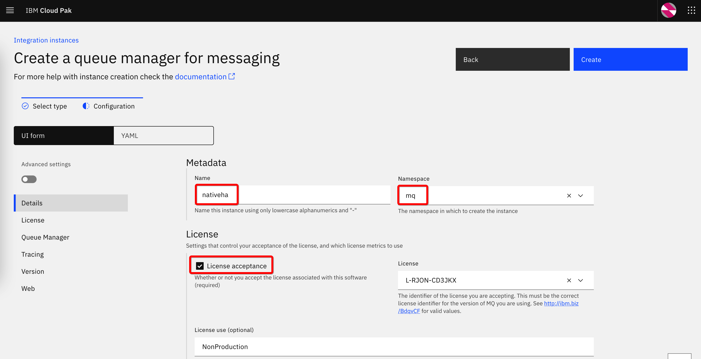
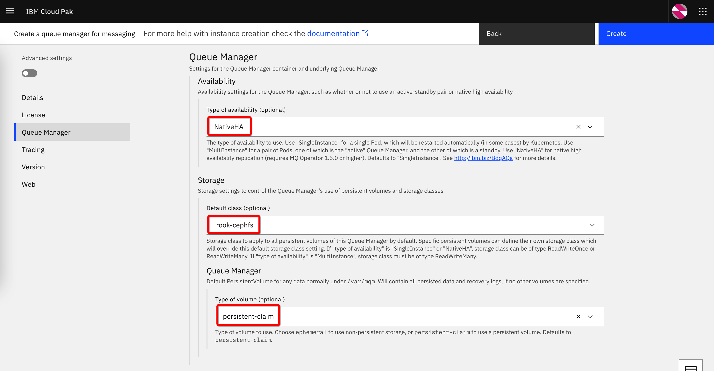
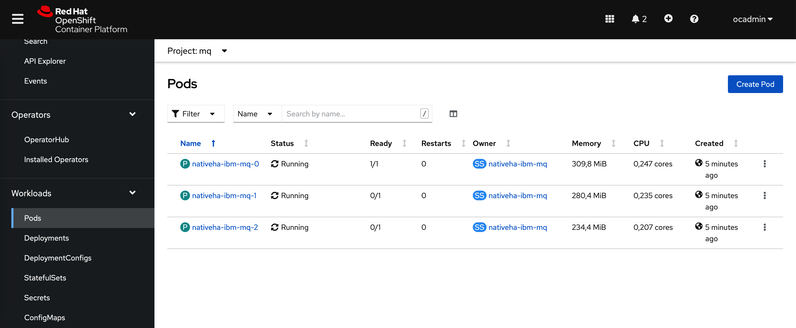

# IBM MQ - NativeHA

## Prerequisites

You must have installed IBM Cloud Pak for Integration - including the IBM MQ operator.
The OpenShift secret with [IBM Entitlement Key](https://www.ibm.com/docs/en/cloud-paks/cp-integration/2022.2?topic=installing-applying-your-entitlement-key-online-installation) must be created in the project (namespace) where MQ instance is going to be created (in the bellow examples, the project name is *mq*)

## Configure MQ NativeHA using Platform Navigator

In the *Platform Navigator* interface, navigate to the list of instances and start creating a new instance of the *Messaging* type.

Give some name to the instance, select the namespace and accept the license:

Scroll down to the *Queue Manager* section and select *NativeHA* for the **Type of availability**. This type of configuration requires a **persistent storage**. Select an RWX or RWO storage class that is available in your environment. In this example, we use *rook-cephfs*. Select also *persistent-claim* for the type of volume:

You may leave default values for other properties. Click on **Create**

## Result 

As a result, three pods will be created. One of them will have a running container and the other two will be on "standby". 

There will be also persistent volume claims created for each of the pods:

**...TO BE CONTINUED...**
