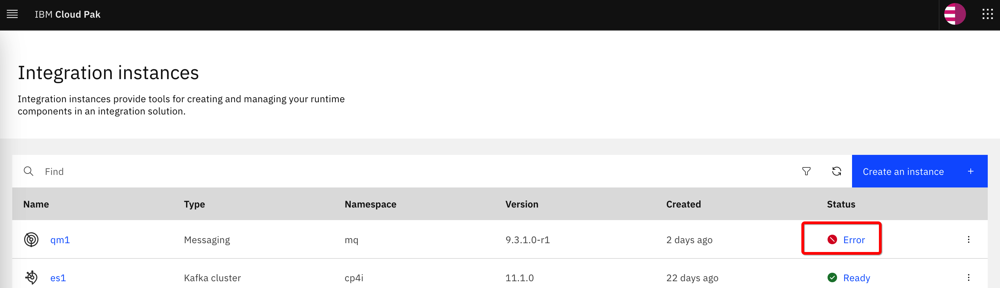

# MQ management


## The question of starting/stopping queue manager running in OpenShift/Kubernetes

This question is related to one of the main differences between traditional and containerized environments. Traditional environments typically contain many running applications, processes, services, or whatever we call them. It is therefore logical that we need a way how to start or stop one of those applications. On the other hand, a container contains only one target service and minimal dependencies that are needed by that service. Therefore the question of starting/stopping the application often means starting/stopping the container itself.

In Kubernetes environments, the containers run in [pods](https://kubernetes.io/docs/concepts/workloads/pods/). A pod is a minimal unit of execution. Despite it is possible to manually create and start pods, they are usually controlled by other Kubernetes objects like [Deployments](https://kubernetes.io/docs/concepts/workloads/controllers/deployment/) and [StatefulSets](https://kubernetes.io/docs/concepts/workloads/controllers/statefulset/). Please use the links provided here to read more about those objects.

We cannot stop the pod and leave it in some kind of "stopped" state. Even if we try to kill the pod, it will be automatically restarted. What we can do instead is to tell the control objects to reduce the number of pod replicas to zero.

The MQ pods are managed by the StatefulSets. We can use the OpenShift console to decrease number of instances to zero:

 

You can do the same from the command line. Login to the OpenShift and navigate to the project where the instance of the MQ is running. Let's say that the project name is also *mq*:
```
oc project mq
```
List the stateful sets:
```
oc get statefulsets
```
Let's assume that the command returns the following result:
```
NAME         READY   AGE
qm1-ibm-mq   1/1     37h
```
You can stop the queue manager by decreasing the number of replicas to zero:
```
oc scale statefulset/qm1-ibm-mq --replicas 0
```
You can start it again by increasing the replicas back to one:
```
oc scale statefulset/qm1-ibm-mq --replicas 1
```

Please note that while the number of replicas is zero, the Platform Navigator will show the error for the MQ instance, this is expected behavior:



>It is theoretically possible to navigate into the container using the command line or OpenShift web console and run commands *endmqm* and *strmqm* as in the traditional environment. Stopping the queue manager in that way will also stop the container inside the pod. This can cause unpredictable side effects and it is better to avoid it.


## Investigating issues

Please see the following article that describes in detail some basic methods of investigating the pod issues: https://docs.openshift.com/container-platform/4.10/support/troubleshooting/investigating-pod-issues.html#accessing-running-pods_investigating-pod-issues

Very often a quick solution for problems in Kubernetes is deleting the pods. If something is stuck, just delete the pod and it will be recreated:
```
oc delete pod/<pod> -n <namespace>
```
