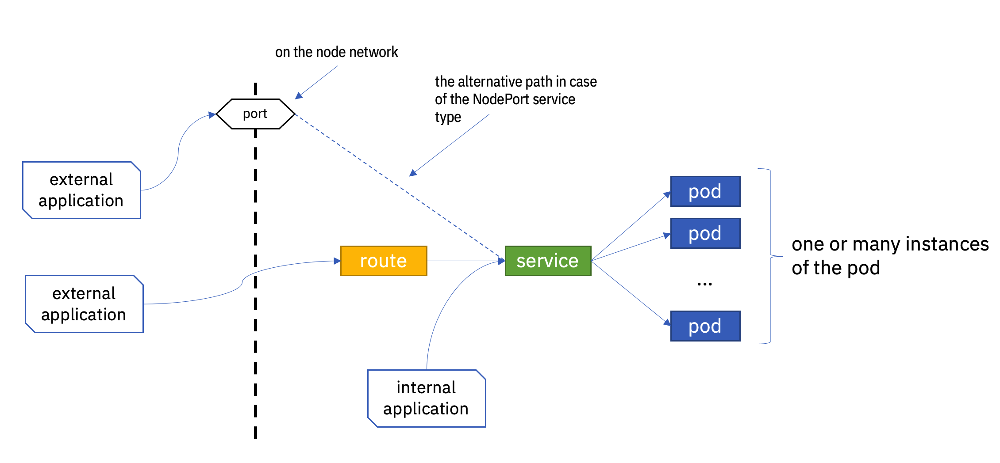

# Networking in OpenShift

Networking in OpenShift and generally in Kubernetes is a large and complex topic. There are available plenty of books and Internet sources that cover it. We will explain here some basic concepts that are necessary to start working with CP4I and MQ. 

- The basic unit of execution in Kubernetes is a *pod*. It consists of one or more containers. The containers that belong to the same pod "see" each other as they are on the "localhost".

- There are three different internal networks inside the Kubernetes cluster, each with a specific range of IP addresses. Those are the pods' network, services, and cluster nodes network. 

- Each pod has an associated IP address. Pods are able to communicate with each other using their network. But, this is not recommended way of building the solution. At the very basis of the Kubernetes idea is an assumption that a pod is something ephemeral. It can be destroyed and recreated at any moment and it can be moved to another cluster node by the Kubernetes scheduler.

- Because of this ephemeral pod's nature, the concept of *service* was invented. The service acts as a proxy that forwards requests to the pod. Since it is stable and reliable we prefer to send requests to the service instead of directly to the pod. 

- Services have also a role related to workload management. Because of the need of handling the load, there can be many *instances* of the same pod being created (how exactly we achieve that is another important Kubernetes topic). In this situation, the service acts as a proxy to all pod instances and does balancing the load between them.

- There are several different types of services. We will mention here just two of them. One is the *ClusterIP* service type and the other is the *NodePort* type.  The ClusterIP service is visible only inside the cluster and it is the most commonly used service type. The NodePort type is mapped to a specific port on the cluster nodes network. This is one of the possible solutions for accessing service from the outside. In this case, we can send a request from the external world to the IP address of any of the cluster nodes using this specific port and the request will reach our service. 

- There are several *ingress* solutions for accessing services from the external world in basic Kubernetes. The solution that is specific to OpenShift is called *Route*. 

- The OpenShift Route exposes the service to the external world by defining the *hostname* for this service (the underlying wildcard DNS records are used for that).

- There is one detail that is maybe not that much emphasized in the documentation but could be important for our MQ story. The route uses the HTTPS protocol. But, what is "hidden" under HTTPS is not necessarily the HTTP. HTTPS can act as an "envelope" around something that can be any other protocol. In our case MQ.

More details can be found here:

- General Kubernetes:
  https://kubernetes.io/docs/concepts/cluster-administration/networking/

- OpenShift specifics:  
  https://docs.openshift.com/container-platform/4.10/networking/understanding-networking.html

- Despite being a little bit older, this is a very good series of articles that explain networking in Kubernetes:
  - Part 1: https://medium.com/google-cloud/understanding-kubernetes-networking-pods-7117dd28727
  - Part 2: https://medium.com/google-cloud/understanding-kubernetes-networking-services-f0cb48e4cc82
  - Part 3: https://medium.com/google-cloud/understanding-kubernetes-networking-ingress-1bc341c84078
