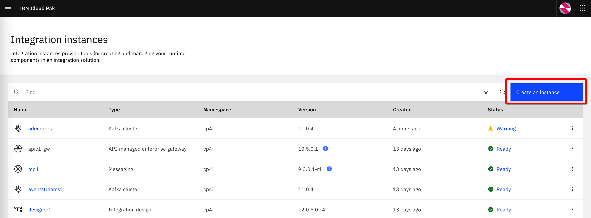
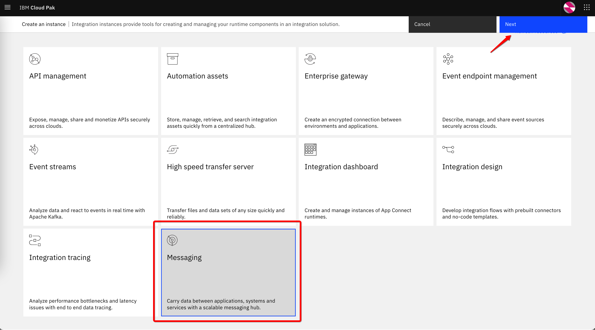
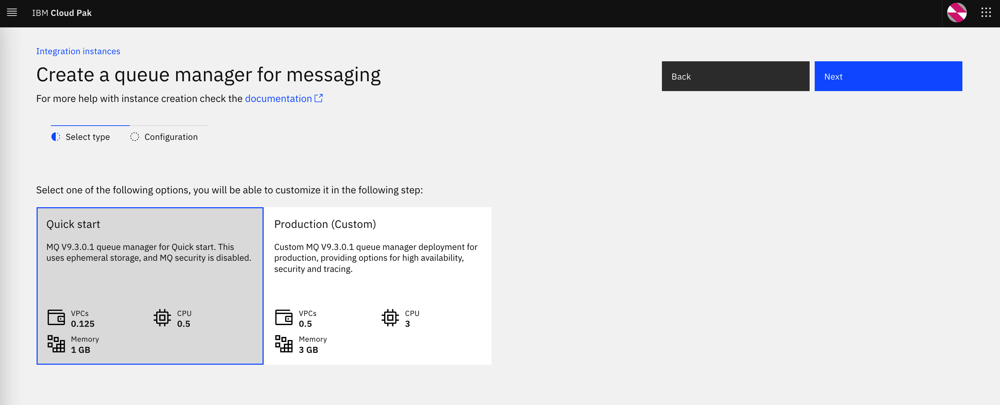
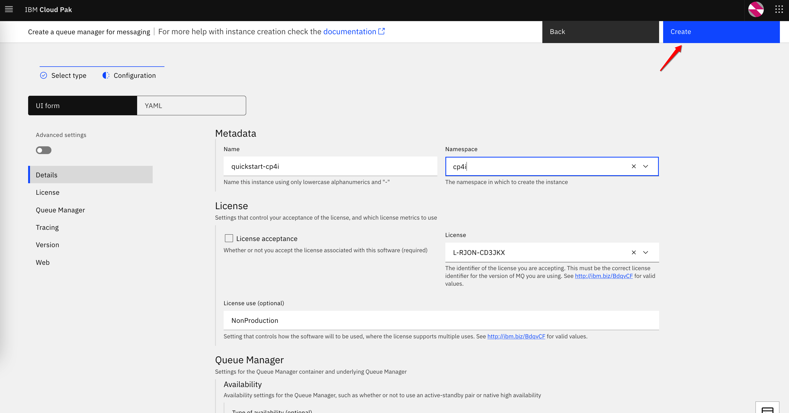
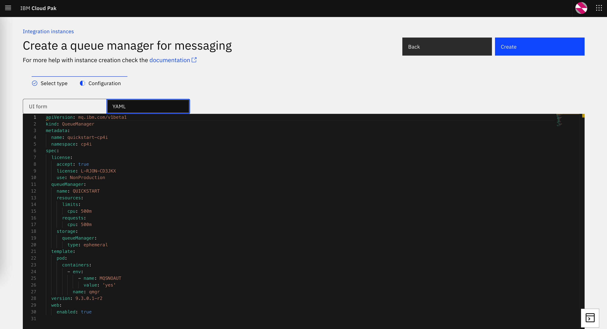

# Setting up QMgrs


After the IBM Cloud Pak for Integration is installed, the easiest way to create the queue manager is to use the Platform Navigator. Go to the **Integration instances** (in the Platform Navigator menu), click **Create an instance**:



Select **Messaging** and click on **Next**:



Select one of two provided preconfigured options and click on **Next**:



Enter the properties in the provided form and click on **Create**:



As an alternative, you can switch to the YAML view:



You can edit the YAML structure and click on *Create* when ready, or you can copy the YAML content and use it later for creating with `oc` command line, from the OCP web console, or in combination with any CI/CD, DevOps solution 

This is an example of the simplest YAML representation of the MQ queue manager:

```yaml
apiVersion: mq.ibm.com/v1beta1
kind: QueueManager
metadata:
  name: quickstart-cp4i
  namespace: cp4i
spec:
  license:
    accept: true
    license: L-RJON-CD3JKX
    use: NonProduction
  queueManager:
    name: QUICKSTART
    resources:
      limits:
        cpu: 500m
      requests:
        cpu: 500m
    storage:
      queueManager:
        type: ephemeral
  template:
    pod:
      containers:
        - env:
            - name: MQSNOAUT
              value: 'yes'
          name: qmgr
  version: 9.3.0.1-r2
  web:
    enabled: true
```